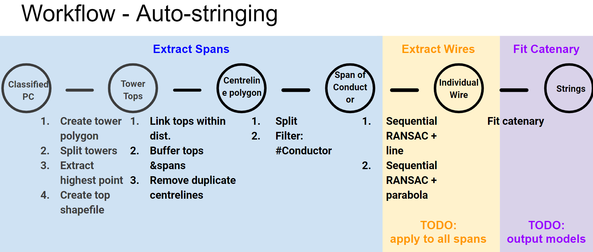

# Auto-generation of Powerline Catenary Strings

## Introduction
This is the initial program developed for Stage 5 of NMRX12030. The purpose of this project is to automatically generate catenary strings from classified point clouds.

## Dependency
This program is tested on Windows with the following packages:

 - Python (3.7.7)
 - Numpy (1.19.1)
 - Pandas (1.0.5)
 - Scikit-learn (0.23.1)
 - GDAL(3.0.2)
 - PDAL (2.0.1)
 - Scipy (1.5.0)
 - Laspy (1.7.0)
 - LAStools

## Usage

The following steps illustrate the application on NMLP19104 SSE Trial data.



1. Copy classified point clouds from `W:\NMRX12030\Stage5\NMLP19104-SSE\Product30\v4` to local. LAZ files with only the Structure and Conductor classes from the Product 30 are available at `W:\NMRX12030\Stage5\NMLP19104-SSE\AutoStringing\Input_test\Network`. Use this as input to reduce memory usage during testing.

2. Update configurations in `config.py`
3. Apply auto-strining on the data:
```shell
python auto-string.py
```
Example outputs of the program is available at: `W:\NMRX12030\Stage5\NMLP19104-SSE\AutoStringing`
## Three Components
Three main steps are wrapped in the script:
1. Extract spans: this is a completed component of this program. It taks the Product30 and extracts spans of Conductor points. Please note that the accuracy of extracted spans is not evaluated. It is expected that there are false positive spans. How to improve the accuracy of extracted spans needs to be designed.
2. Extract wires: this is a complete component of this program. However, it assumes that all the extracted spans from the previous component are accurate. Currently it only takes a test span (specified in `config.py`) and extracts individual wires. It needs further development to take all the extracted spans from the previous components as inputs. Then there may be questions about how to deal with inaccurate spans.
3. Fit catenary: this is an incomplete component of this program. Currently it takes the extracted wires from the previous component and print out parameters of fitted catenaries. It needs further development to output results (e.g. shapefile off all fitted catenaries). 
## Documentations
| Desctiption | Path |
|--|--|
| Report | G:\Shared drives\NMRX12030 Automated Classification KTP\04_Design\Documentation\Methodology_Stage5.docx |